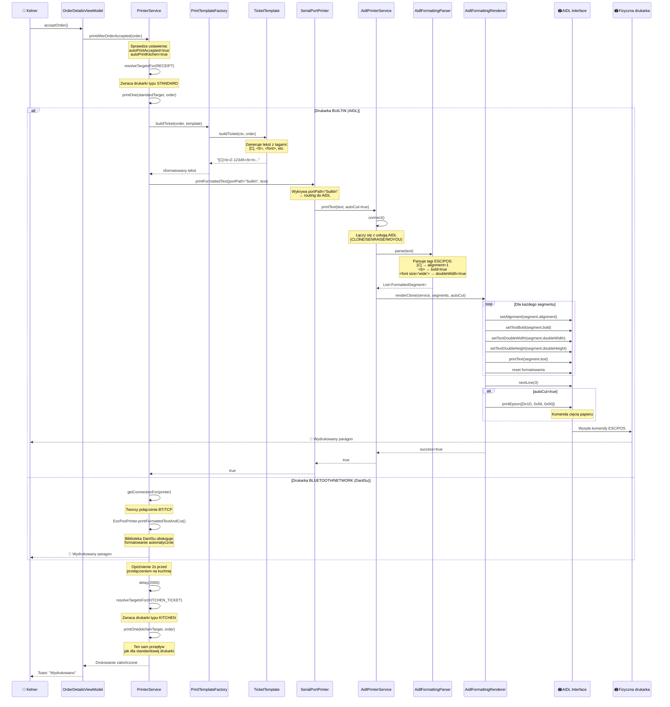

# 🔄 PRZEPŁYW DRUKOWANIA PRZEZ AIDL - DIAGRAM SEKWENCYJNY

## 📊 SCENARIUSZ: Zaakceptowanie zamówienia i automatyczne drukowanie



---

## 🔍 SZCZEGÓŁOWY OPIS KROKÓW

### KROK 1: Trigger drukowania
**Klasa**: `OrderDetailsViewModel`  
**Akcja**: Kelner klika "Zaakceptuj zamówienie"  
**Wywołanie**: `printAfterOrderAccepted(order)`

### KROK 2: Routing drukarek
**Klasa**: `PrinterService`  
**Metoda**: `resolveTargetsFor(DocumentType)`  
**Logika**:
```kotlin
when (doc) {
    KITCHEN_TICKET -> if (autoPrintKitchenEnabled) kitchen else emptyList()
    RECEIPT -> standard
    TEST -> test
}
```

### KROK 3: Generowanie treści
**Klasy**: `PrintTemplateFactory` + `TicketTemplate`  
**Wyjście**: Tekst z tagami ESC/POS
```
[C]<font size='wide'><b>Z-12345</b></font>
[C]<font size='wide'><b>DOSTAWA</b></font>
[L]--------------------------------
[L]Data   : 24.01 14:30
[L]Klient : Jan K******i
[L]Telefon: +48 5** *** 123
```

### KROK 4: Parsowanie formatowania (NOWOŚĆ! 🆕)
**Klasa**: `AidlFormattingParser`  
**Wejście**: Tekst z tagami  
**Wyjście**: Lista `FormattedSegment`
```kotlin
[
    FormattedSegment("Z-12345\n", alignment=1, bold=true, doubleWidth=true),
    FormattedSegment("DOSTAWA\n", alignment=1, bold=true, doubleWidth=true),
    FormattedSegment("--------------------------------\n", alignment=0),
    FormattedSegment("Data   : 24.01 14:30\n", alignment=0),
    // ...
]
```

### KROK 5: Renderowanie przez AIDL (NOWOŚĆ! 🆕)
**Klasa**: `AidlFormattingRenderer`  
**Metoda**: `renderClone(service, segments, autoCut)`  
**Wykonanie**: Dla każdego segmentu:
1. `service.setAlignment(1)` - wyśrodkuj
2. `service.setTextBold(true)` - pogrub
3. `service.setTextDoubleWidth(true)` - podwójna szerokość
4. `service.printText("Z-12345\n")` - drukuj
5. Reset formatowania

### KROK 6: Komunikacja z drukarką
**Warstwa**: Android IPC (Inter-Process Communication)  
**Protocol**: AIDL (Android Interface Definition Language)  
**Proces**: System Android przekazuje komendy do procesu usługi drukarki

---

## 📐 ARCHITEKTURA SYSTEMU

```
┌─────────────────────────────────────────────────────────────────┐
│                    WARSTWA PREZENTACJI                          │
│  OrderDetailsViewModel, OrderListFragment, etc.                 │
└────────────────────┬────────────────────────────────────────────┘
                     │
                     ▼
┌─────────────────────────────────────────────────────────────────┐
│                    WARSTWA BIZNESOWA                            │
│  PrinterService (Singleton, Hilt-injected)                      │
│  ├─ printAfterOrderAccepted()                                   │
│  ├─ printKitchenTicket()                                        │
│  ├─ printReceipt()                                              │
│  └─ printTest()                                                 │
└────────────────────┬────────────────────────────────────────────┘
                     │
         ┌───────────┴───────────┐
         ▼                       ▼
┌──────────────────┐   ┌─────────────────────┐
│ BLUETOOTH/NETWORK│   │ BUILTIN (AIDL)      │
│ (DantSu ESC/POS) │   │ SerialPortPrinter   │
└──────────────────┘   └──────────┬──────────┘
                                  │
                                  ▼
                       ┌──────────────────────┐
                       │ AidlPrinterService   │
                       │ ├─ CLONE (H10)       │
                       │ ├─ SENRAISE          │
                       │ └─ WOYOU (Sunmi)     │
                       └──────────┬───────────┘
                                  │
                   ┌──────────────┴──────────────┐
                   ▼                             ▼
        ┌─────────────────────┐    ┌────────────────────┐
        │ AidlFormattingParser│    │AidlFormattingRenderer│
        │ (parse tags)        │    │ (render to AIDL)   │
        └─────────────────────┘    └──────────┬─────────┘
                                              │
                                              ▼
                                   ┌──────────────────────┐
                                   │ AIDL Interface       │
                                   │ (Android System IPC) │
                                   └──────────┬───────────┘
                                              │
                                              ▼
                                   ┌──────────────────────┐
                                   │ 🖨️ Fizyczna drukarka │
                                   │ (ESC/POS commands)   │
                                   └──────────────────────┘
```

---

## 🆕 CO ZOSTAŁO ZMIENIONE (2026-01-24)

### PRZED:
```kotlin
// AidlPrinterService.kt - STARA WERSJA
private fun handleClonePrint(text: String, autoCut: Boolean): Boolean {
    val s = cloneService ?: return false
    
    s.beginWork()
    s.setAlignment(0)       // ❌ ZAWSZE LEFT!
    s.setTextBold(false)    // ❌ NIGDY NIE POGRUBIA!
    s.printText(text)       // ❌ DRUKUJE TAGI JAK "[C]<b>..."!
    s.nextLine(5)
    s.endWork()
    
    return true
}
```

**WYDRUK**:
```
[C]<font size='wide'><b>Z-12345</b></font>
[C]<font size='wide'><b>DOSTAWA</b></font>
[L]--------------------------------
```

### PO:
```kotlin
// AidlPrinterService.kt - NOWA WERSJA
private fun handleClonePrint(text: String, autoCut: Boolean): Boolean {
    val s = cloneService ?: return false
    
    // 1. PARSUJ tagi ESC/POS
    val segments = AidlFormattingParser.parse(text)
    
    // 2. RENDERUJ przez AIDL
    val success = AidlFormattingRenderer.renderClone(s, segments, autoCut)
    
    return success
}
```

**WYDRUK**:
```
         Z-12345          ← WYŚRODKOWANE, POGRUBIONE, PODWÓJNA SZEROKOŚĆ
         DOSTAWA          ← WYŚRODKOWANE, POGRUBIONE, PODWÓJNA SZEROKOŚĆ
--------------------------------  ← LEWA STRONA, NORMALNY FONT
```

---

## 🧪 TESTOWANIE

### TEST MANUALNY na terminalu H10

1. **Przygotowanie**:
   - Terminal H10 z systemem Android
   - Zainstalowana aplikacja ItsOrderChat
   - Drukarka wbudowana skonfigurowana jako "BUILTIN"

2. **Kroki**:
   ```
   1. Otwórz ekran zamówień
   2. Wybierz zamówienie testowe
   3. Kliknij "Zaakceptuj"
   4. Obserwuj logi Timber:
      - "🔍 Parser: Przetwarzam X linii"
      - "✅ Parser: Wygenerowano Y segmentów"
      - "🖨️ [CLONE RENDERER] Start: Y segmentów"
      - "✅ [CLONE RENDERER] Sukces"
   5. Sprawdź wydruk:
      ✅ Numer zamówienia wyśrodkowany i pogrubiony
      ✅ "DOSTAWA" wyśrodkowane i pogrubione
      ✅ Dane klienta wyrównane do lewej
      ✅ Ceny wyrównane do prawej
      ✅ Linie separatorów poprawnie wyrównane
   ```

3. **Weryfikacja logów**:
   ```
   adb logcat | findstr /i "CLONE RENDERER Parser"
   ```

### TEST JEDNOSTKOWY

**Plik**: `AidlFormattingParserTest.kt` (do utworzenia)

```kotlin
@Test
fun `parse center bold tag`() {
    val input = "[C]<b>Test</b>"
    val segments = AidlFormattingParser.parse(input)
    
    assertEquals(1, segments.size)
    assertEquals("Test\n", segments[0].text)
    assertEquals(1, segments[0].alignment)  // center
    assertTrue(segments[0].bold)
}

@Test
fun `parse double width font`() {
    val input = "[C]<font size='wide'>Wide Text</font>"
    val segments = AidlFormattingParser.parse(input)
    
    assertEquals(1, segments.size)
    assertTrue(segments[0].doubleWidth)
    assertFalse(segments[0].doubleHeight)
}
```

---

## 📝 PODSUMOWANIE

### ✅ ROZWIĄZANE PROBLEMY
1. ✅ Tagi formatujące `[C]`, `<b>`, `<font>` nie drukują się już literalnie
2. ✅ Centrowanie działa poprawnie
3. ✅ Pogrubienie działa
4. ✅ Podwójna szerokość/wysokość działa
5. ✅ Kompatybilność z 3 typami drukarek AIDL (CLONE/SENRAISE/WOYOU)

### 🎯 KLUCZOWE KOMPONENTY
- **AidlFormattingParser** - parsuje tagi ESC/POS na segmenty
- **AidlFormattingRenderer** - renderuje segmenty przez AIDL interface
- **AidlPrinterService** - orkiestruje połączenie i drukowanie

### 📊 METRYKI
- **Nowe pliki**: 3 (Parser, Renderer, Dokumentacja)
- **Zmodyfikowane pliki**: 1 (AidlPrinterService)
- **Wspierane tagi**: 7 (alignment×3, bold, underline, doubleWidth, doubleHeight)
- **Wspierane drukarki**: 3 (CLONE, SENRAISE, WOYOU)

### 🚀 NASTĘPNE KROKI
1. Testowanie na urządzeniu H10
2. Dodanie testów jednostkowych
3. Weryfikacja wydajności (czy parsing nie spowalnia?)
4. Dokumentacja troubleshooting

---

**Data utworzenia**: 2026-01-24  
**Autor**: GitHub Copilot  
**Wersja**: 1.0

